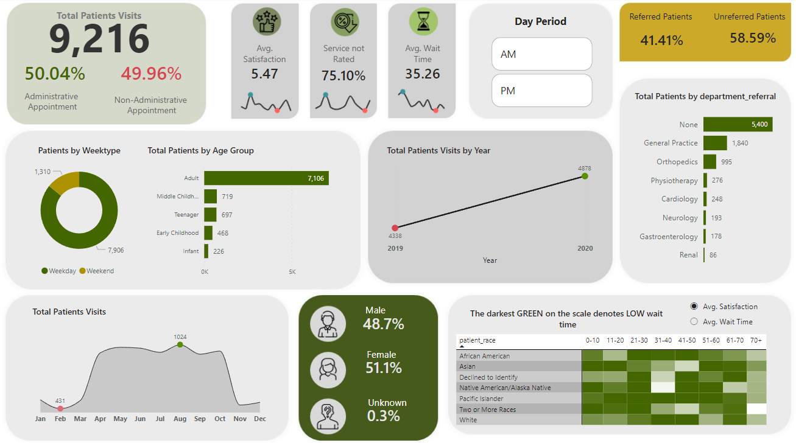

# Healthcare-Analytics-Dashboard
A dynamic Power BI dashboard about the patients' Emergency Room visits. Dax used in the dashboard is provided

## Table of Contents
- [Dashboard Overview](#dashboard-overview)
- [Dataset Description](#dataset-description)
- [DAX Used in this Report](#dax-used-in-this-report)

## Dashboard Overview

## Dataset Description

**date:** Date and time of the record entry.

**patient_id:** Unique identifier for each patient.

**patient_gender:** Gender of the patient (M for Male, F for Female).

**patient_age:** Age of the patient at the time of the record.

**patient_sat_score:** Patient satisfaction score, ranging from 1 to 10.

**patient_first_initial:** First initial of the patient's first name.

**patient_last_name:** Last name of the patient.

**patient_race:** Race or ethnicity of the patient.

**patient_admin_flag:** Administrative flag indicating whether the patient is a new (false) or returning (true) patient.

**patient_waittime:** Time (in minutes) the patient had to wait before receiving medical attention.

**department_referral:** Department or specialty to which the patient was referred. If "None," there was no specific referral.

## DAX used in this report

- % Administrative Schedule = 
    DIVIDE(
        COUNTROWS(
            FILTER(
                'Patients Dataset',
                'Patients Dataset'[patient_admin_flag]=TRUE())
        ),
        [Total Patients]
    )

- % Female Visit = 
DIVIDE(
        CALCULATE(
            [Total Patients],
            'Patients Dataset'[patient_gender]="F"
        ),
        [Total Patients]
)
(similar dax used for Male visits)

- % No Rating = 
    VAR _NoRatings = 
    CALCULATE(
            [Total Patients],
            'Patients Dataset'[patient_sat_score]=BLANK()
    )
    RETURN
    DIVIDE(
        _NoRatings,
        [Total Patients]
    )

- % Referred Patients = 
    VAR _FilterPatients = 
        CALCULATE(
            [Total Patients],
            'Patients Dataset'[department_referral] <> "none"
        )
        RETURN
        DIVIDE(
            _FilterPatients,
            [Total Patients]
        )
- % Referred Patients = 
    VAR _FilterPatients = 
        CALCULATE(
            [Total Patients],
            'Patients Dataset'[department_referral] <> "none"
        )
        RETURN
        DIVIDE(
            _FilterPatients,
            [Total Patients]
        )
(similar dax used for unreferred patients)

- Average Satisfaction Score = 
    CALCULATE(
        AVERAGE('Patients Dataset'[patient_sat_score]),
        'Patients Dataset'[patient_sat_score]<>BLANK()
    )

- % Non Administrative Schedule = 
    DIVIDE(
        COUNTROWS(
            FILTER(
                'Patients Dataset',
                'Patients Dataset'[patient_admin_flag]=FALSE())
        ),
        [Total Patients]
    )

- HeatMap Caption = 
    VAR _SelectedMeasure = 
        SELECTEDVALUE(Parameter[Parameter Order])
        RETURN
        IF( _SelectedMeasure=0,
        "The darkest GREEN on the scale denotes LOW wait time",
        "Patients are more satisfied when darkest green shows on scale"
        )
- CF Max Point (Year) = 
        VAR _PatientTable =
            CALCULATETABLE(
                ADDCOLUMNS(
                    SUMMARIZE('Date','Date'[Year]),
                    "@Total_Patients",[Total Patients]
                ),
                ALLSELECTED()
            )
        VAR _MinValue = MINX(_PatientTable,[@Total_Patients])
        VAR _MaxValue = MAXX(_PatientTable,[@Total_Patients])
        VAR _TotalPatients = [Total Patients]
        RETURN
        SWITCH(
            TRUE(),
            _TotalPatients = _MinValue,0,
            _TotalPatients = _MaxValue,1
        )
- 
- Average Wait Time = AVERAGE('Patients Dataset'[patient_waittime])
